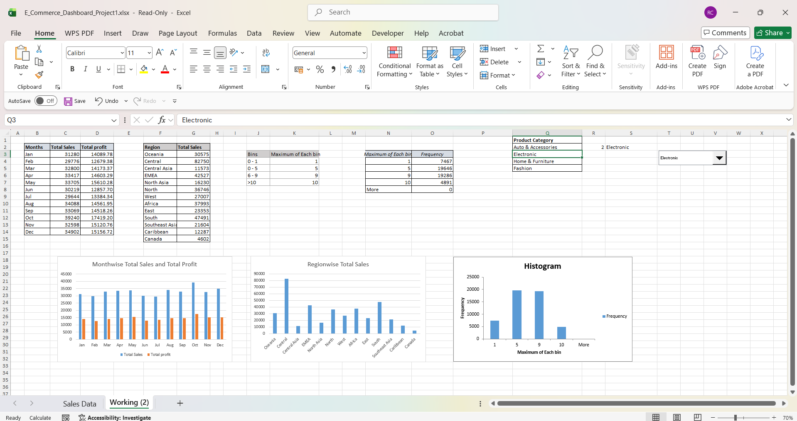

# E-Commerce Sales Dashboard (Excel)

## Project Overview
This project presents an interactive Excel dashboard designed to analyze e-commerce sales performance across product categories and regions.
The dashboard enables business users to monitor sales trends, identify profitable regions, and explore product category performance through dynamic visualizations.

---

## Problem Statement
An e-commerce company wants to analyze sales performance across different product categories and regions.
The objective is to create an interactive Excel dashboard that allows users to:

- Analyze sales and profit trends month-by-month
- Compare sales performance across regions
- Filter results by product category
- Identify high-performing products and regions

---

## Tools & Technologies
- Microsoft Excel
- Pivot Tables
- SUMIFS
- Combo Box
- Charts
- Histogram
- Data Analysis Toolpak

---

## Key Features
- Month-wise sales and profit analysis
- Region-wise sales comparison
- Product category filtering
- Interactive Excel dashboard
- Visual sales trend charts

---

## Dashboard Preview

---

## Project Files
- `E_Commerce_Dashboard_Project1.xlsx` – Interactive Excel Dashboard
- `Dashboard-Preview.png` – Dashboard screenshot
